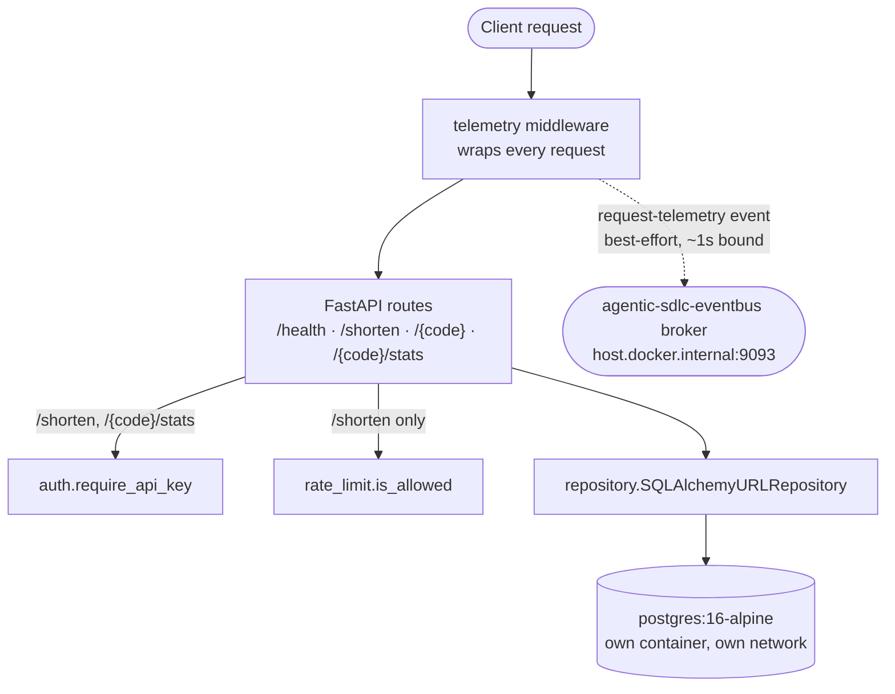

# url-shortener-api

FastAPI URL shortener: `POST /shorten`, `GET /{code}` (redirect), `GET /{code}/stats`,
`GET /health`. API-key auth on write/analytics endpoints, an in-process fixed-window rate
limiter on `/shorten`, and a Kafka telemetry publish on every request. Own `postgres:16-alpine`
— no other repo may connect to it (database-per-service).

## Tech stack

- **Framework**: [FastAPI](https://fastapi.tiangolo.com/) 0.136.1, Uvicorn 0.34.0
- **Database**: PostgreSQL 16 (Alpine), SQLAlchemy 2.0.36, psycopg 3.2.3
- **Events**: kafka-python-ng 2.2.3, `agentic-events` (shared envelope contract)
- **Auth**: API-key header (`hmac.compare_digest`), in-process fixed-window rate limiting
- **Testing**: pytest 8.3.4, pytest-cov 7.1.0, FastAPI `TestClient` (httpx 0.28.1)
- **Infra**: Docker Compose, Docker BuildKit secrets, GitHub Actions CI

## Architecture



Auth and rate-limiting only gate the routes that need them (`/{code}` redirect stays public by
design — see `auth.py`'s docstring). The telemetry middleware wraps every request regardless of
which path it took, which is why it's drawn wrapping the whole flow rather than sitting after one
specific route.

### Kafka telemetry

Every request — not just successful `/shorten` calls — publishes a `request-telemetry` event to
`url-shortener.request-telemetry.v1` (partition key = the `{code}` path param, or `null` when a
request has none, e.g. `/health`). This is deliberately broader than "publish after a DB commit":
the platform's drift metrics (status-code distribution, 404-on-redirect rate,
rate-limit-rejection rate) need coverage of failed and rejected requests too, which don't touch
the database at all. The middleware runs *after* `call_next`, so for DB-mutating routes the
publish still happens strictly after that route's own Postgres commit — this service's
transactional boundary is preserved.

Publishing is best-effort and never blocks or fails the response: if `KAFKA_BOOTSTRAP_SERVERS`
is unset, or the producer can't be constructed, or a send fails, telemetry is silently
skipped/logged and the HTTP response is unaffected. `/health` reports `configured`, `publishing`
and `publish_failures` separately, so a broker that is set but unreachable is distinguishable
from telemetry being switched off deliberately.

The bounded background-thread construction that makes this hold is
[`docs/adr/0001`](docs/adr/0001-bounded-background-producer-construction.md); the layout
decisions are [`0002`](docs/adr/0002-package-stays-at-the-repository-root.md) and
[`0003`](docs/adr/0003-the-repository-layout-is-enforced-by-a-test.md).

## Quickstart

One-time setup — copy the secret template and fill in a real value:

```bash
cp secrets/postgres_password.txt.example secrets/postgres_password.txt
# edit secrets/postgres_password.txt: a password of your choosing
```

```bash
docker compose up -d --build
docker compose ps   # wait for both services healthy
curl http://localhost:8000/health
```

`KAFKA_BOOTSTRAP_SERVERS` defaults to `host.docker.internal:9093` — bring up
`agentic-sdlc-eventbus`'s compose stack first if you want telemetry to actually land somewhere;
the API works fine without it (telemetry just gets skipped, logged once).

`API_KEY` is **not** set by compose and falls back to a publicly known development default.
Set it explicitly for anything reachable by anyone else — see [`SECURITY.md`](SECURITY.md).

## Local development

```bash
python -m venv .venv && source .venv/Scripts/activate   # or .venv/bin/activate on Linux/WSL
pip install -r requirements.txt
```

To match CI's resolution exactly — pinned versions plus hashes, with the `agentic-events` git
tag resolved to a commit SHA:

```bash
pip install --require-hashes -r requirements.lock
```

Regenerate that lock whenever `requirements.txt` changes, or CI will fail asking you to:

```bash
uv pip compile requirements.txt --universal --generate-hashes --python-version 3.12 -o requirements.lock
```

Contribution rules, and which test tier a new test belongs in, are in
[`CONTRIBUTING.md`](CONTRIBUTING.md).

## Testing

Tests are split into four tiers by what each one needs. The marker is derived from the
directory by `tests/conftest.py`, never written by hand — a test file outside the tiers fails
collection rather than being silently skipped by a marker-filtered run.

| Tier | Needs | Tests |
|---|---|---|
| `tests/unit/` | nothing outside the process | 21 |
| `tests/contract/` | nothing outside the process | 8, plus the structure test |
| `tests/integration/` | a real engine, the ASGI stack | 17 |
| `tests/evaluation/` | a real Kafka broker | 1 |

```bash
pytest                                    # everything
pytest -m unit                            # one tier
pytest --cov=url_shortener --cov-report=term-missing --cov-fail-under=97   # what CI runs
```

The evaluation tier skips when no broker is reachable, so a plain `pytest` runs clean with
nothing started. Start `agentic-sdlc-eventbus`'s stack and set `URL_SHORTENER_REQUIRE_BROKER=1`
to turn that skip into a failure, which is what you want whenever you have actually started one.

### Coverage

CI enforces a floor of 97% (`--cov-fail-under=97`), so coverage can only ratchet upward.
Measured with a broker reachable:

```
47 passed

Name                          Stmts   Miss  Cover   Missing
-----------------------------------------------------------
url_shortener\__init__.py         0      0   100%
url_shortener\auth.py            10      0   100%
url_shortener\db.py              39      5    87%   60, 64-68
url_shortener\main.py            63      0   100%
url_shortener\models.py          14      0   100%
url_shortener\rate_limit.py      18      0   100%
url_shortener\repository.py      24      0   100%
url_shortener\schemas.py         14      0   100%
url_shortener\telemetry.py       59      0   100%
-----------------------------------------------------------
TOTAL                           241      5    98%
```

Without a broker the evaluation tier skips and `telemetry.py` line 73 — the early return taken
once a producer already exists — goes uncovered, giving `46 passed, 1 skipped` and `241/6`.
Both are above the floor; CI sees the second.

The remaining gap is deliberate. `db.py` lines 60 and 64-68 are the real `init_db`/`get_session`
bodies, which tests substitute via `monkeypatch`/`dependency_overrides` so the unit suite never
touches a real database.

### Verification beyond unit tests

The cross-repo broker verification, the automated seam test that replaced the manual exercise,
and the two defects it found are in
[`tests/evaluation/REPORT.md`](tests/evaluation/REPORT.md) — beside the test that reproduces
them rather than in this file.

## Deployment and CI

`.github/workflows/ci.yml` needs no repository secrets. `agentic-events` is hosted in
`agentic-sdlc-eventbus`, which is public, so both `pip install` and `docker build` resolve it
over anonymous HTTPS — a fork of this repo builds green with nothing to configure.

Two jobs, and both are required status checks on `main`: `test` (coverage floor, lock currency,
mermaid parsing) and `compose-smoke-test` (builds the stack and hits `/health`). **Neither may
be renamed without updating the branch-protection ruleset in the same change** — required checks
match a job's display name, so a rename leaves the ruleset waiting on a context nothing reports.

`.github/workflows/security.yml` runs `pip-audit`, a tracked-secret guard, and CodeQL on every
pull request and weekly. It is deliberately not a required check: it reports without blocking.

The container is unaffected by the repository's layout — it installs `requirements.txt`, copies
the tree, and runs `uvicorn url_shortener.main:app` from `WORKDIR /app`. See
[`docs/adr/0002`](docs/adr/0002-package-stays-at-the-repository-root.md) for why the package
stays at the root.
